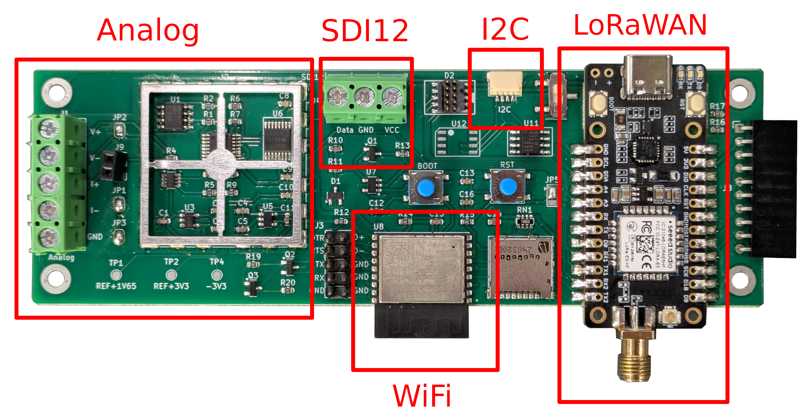
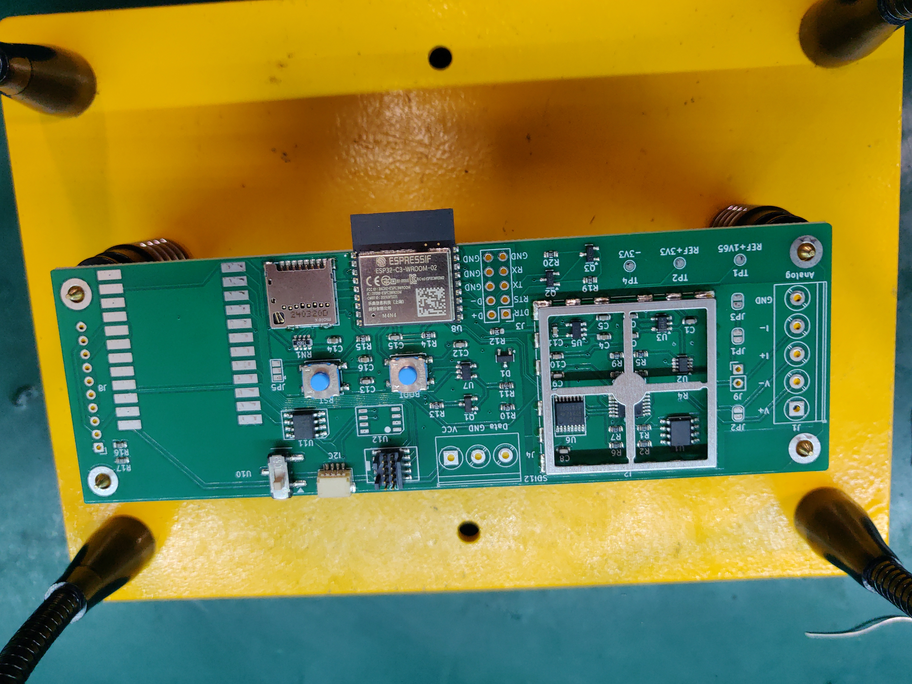
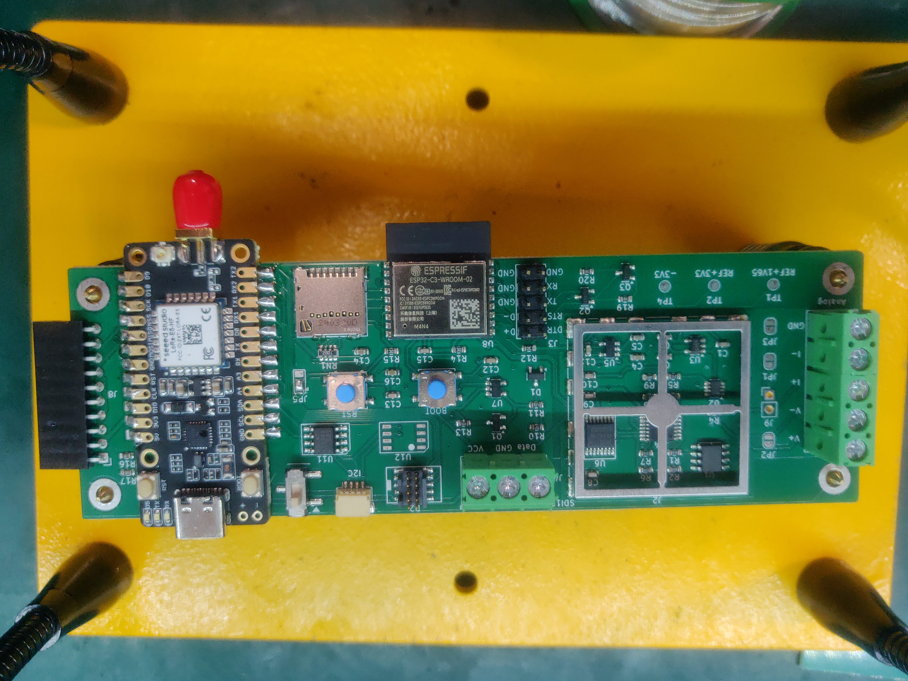

# Environmental NeTwork Sensor (ENTS) Node Hardware

This repo contains the EagleCAD source files for the PCB design of the Soil Power Sensor. The Soil Power Sensor is a iteration on the design of CurrentSense by Lab11(https://github.com/lab11/CurrentSense).

## BOM

The bill of materials is available digitally at https://octopart.com/bom-tool/nBygYAnz or as csv in `hardware/Soil Power Sensor.csv`.

There are two buttons not listed in the BOM for the esp32 `BOOT` and `EN`. These are cheaply available from amazon. Look for one with a 6mm by 6mm form factor.

Generate the BOM from the schematic editor (`Tools -> Generate Bill of Materials...`) and use the view *Order*.

## Assembly and QA Instructions

### Solder SMD components

We suggest ordering the boards SMD assembled through a PCB assembly service and have used [JLCPCB](https://jlcpcb.com/) in the past. Every component except the Wio-E5 module, 5-pin screw terminals, 3-pin screw terminals, and pin headers can be soldered by the assembly service. The component `U13` should not be populated by default and is used to expand the non-volatile memory of sensor measurements.

### Solder Remaining Components

*Before soldering* visually inspect the boards for any solder bridges and defects. You do not want to solder the Wio-E5 module to a defective board as it accounts for half the cost of the board and cannot be desoldered easily.

1. Solder screw terminals at `J1`, `J4`, male pin-headers at `J3`, female right-angle pin headers at `J8`, and female pin headers at `J9`.
2. Solder the Wio-E5 module to the board. The USB-C connector should be facing the edge of the board closest to the switch, and RF terminal facing the microSD card module. The RF terminal should touching the edge of the board.
3. Use a multimeter to test for shorts between `GND` and `TP1`, `TP2`, `TP4`, `5V` on the Wio-E5, `3V3` on the Wio-E5, and `Vcc` on the 3-pin screw terminal. `TP4` maay display a resistance value due to capacitors.

> NOTE: `J9` should be soldered with a female header to be used to connect a load. We did not have any 2x1 headers on hand so it is not shown in the picture.

### Check Power Rails

Then, power the device through the USB-C terminal with the power switch in the "UP" (close to nearest board edge). Verify the voltages at the test points match what is shown in the table. Some rails may be put in power down state by default and require firmware to be running to enable them.

`TP6` is used to used to connect the battery to the Wio-E5 module.

| Test point  | Signal     | Voltage |
| ----------  | ---------- | ------- |
| `TP1`       | `REF+1V65` | +1.65V  |
| `TP2`       | `REF+3V3`  | +3.3V   |
| `3V3` (Wio) | `+3V3`     | +3.3V   |
| `TP4`       | `-3V3`     | -3.3V   |
| `TP5`       | `VCC`      | 5V      |
| `5V` (Wio)  | `VUSB`     | 5V      |

### Load Firmware

See [ENTS-node-firmware](https://github.com/jlab-sensing/ENTS-node-firmware) for instructions on loading firmware on the device.

## Header definitions

### D2 (STM32 SWD)

Serial wire debug (SWD) port for stm32. To load the bootloader, hold `BOOT`, press and release `RST`, then release `BOOT`. Then you should be able to connect to the device.

### J9 (ESP32 Debug Header)

### J3 (ESP32 UART)

UART TX and RX pins to connect to the esp32 bootloader. Intended to be use with a USB to UART converter and `esptool.py`.

### J9 (Battery Connector)

Connect a battery module to the ENTS board. The header is reversible has the following pinout, where `~` represent inverse logic:

| `GND` |
| `3V3` |
| `~PG` |
| `~CHG` |
| `VBAT` |
| `VBAT` |
| `~CHG` |
| `~PG` |
| `3V3` |
| `GND` |

## Measurement configurations

The soil power sensor has multiple measurement configurations. The most common use case is *Common GND* which gives single ended measurements with low-side sensing.

### Independent Inputs (Default)

| Jumper | Bridged |
|---|---|
| `JP1` | No |
| `JP2` | No |
| `JP3` | No |

| Resistor | Value |
|---|---|
| `Rsense1` | DNP |

Inputs `Voltage`, `Current`, `GND` are all independent from each other, therefore the most modular configuration. Use this mode when you want to measure a voltage/current difference that is not relative to `GND`. The `GND` connection must be connected to the common ground of the measured device.

### Common `GND`

| Jumper | Bridged |
|---|---|
| `JP1` | Yes |
| `JP2` | No |
| `JP3` | Yes |

| Resistor | Value |
|---|---|
| `Rsense1` | 0 ohms |

The negative terminals of `Voltage` and `Current` are tied to ground. Both measurements will be relative to ground. Connect common ground to the negative terminals or `GND` terminal.

### Internal load

| Jumper | Bridged |
|---|---|
| `JP1` | Yes |
| `JP2` | Yes |
| `JP3` | Yes |

| Resistor | Value |
|---|---|
| `Rsense1` | Any |

The configuration uses a on-board resistor for `RSENSE1`. The resistor is chosen based on the desired range of input measurements. The board uses a high-side current measurements.

## Userful links

Links for generating production files and BOM for [JLCPCB](https://jlcpcb.com/)

- [Gerber and drill/map files](https://jlcpcb.com/help/article/how-to-generate-gerber-and-drill-files-in-kicad-8)
- [BOM and centroid files](https://jlcpcb.com/help/article/How-to-generate-the-BOM-and-Centroid-file-from-KiCAD)

## License & Copyright

The Soil Power Sensor board design files are licensed under the Solderpad Hardware License (wraparound license of Apache License).

## Maintainers

- John Madden - [jmadden173](https://github.com/jmadden173)
