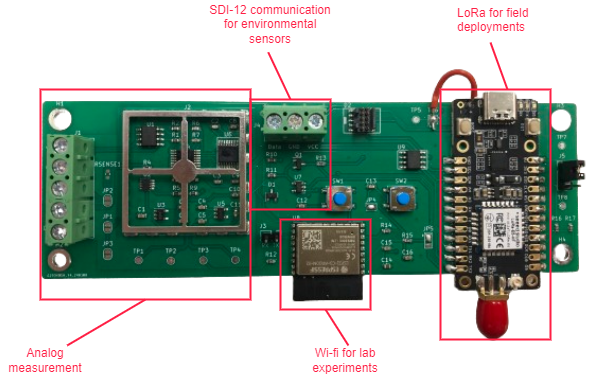

# Environmental NeTwork Sensor (ENTS) Node Hardware



This repo contains the EagleCAD source files for the PCB design of the Soil Power Sensor. The Soil Power Sensor is a iteration on the design of CurrentSense by Lab11(https://github.com/lab11/CurrentSense).

## BOM

The bill of materials is available digitally at https://octopart.com/bom-tool/kEoRBpBH or as csv in `hardware/Soil Power Sensor.csv`.

There are two buttons not listed in the BOM for the esp32 `BOOT` and `EN`. These are cheaply available from amazon. Look for one with a 6mm by 6mm form factor.

Generate the BOM from the schematic editor (`Tools -> Generate Bill of Materials...`) and use the view *Order*.

## Steps for assembly

1. Order PCB, the included gerber files were generated for [JLCPCB](https://jlcpcb.com/)
2. Order components from the BOM.
3. Solder surface mount components, excluding the following
	- Wio-E5
	- Screw Terminals
	- Pin headers
4. Solder remaining through hole components.
5. Solder the AAA battery clips on the bottom of the board.
6. Solder a jumper wire from `J6` to the positive input power on the Wio-E5.

## Clearing the bootloader

The Wio-E5 module comes pre-installed with LoRa AT command firmware with hardware write protection enabled. Before you are able to flash the device the read protection must be cleared using [STM32CubeProgrammer](https://www.st.com/en/development-tools/stm32cubeprog.html) using a ST-Link debugger. We prefer to use the [STLINK-V3MINIE](https://www.st.com/en/development-tools/stlink-v3minie.html) due to its small form factor and low cost.

1. Start `STM32CubeProgrammer`
2. Connect the device and ST-Link device.
3. On the right panel configure the `Port` to `SWD`
4. On the Wio-E5 module, hold `BOOT`, press and release `RST`, then release `BOOT`. You are now in the bootloader.
5. In `STM32CubeProgrammer` press connect. It will give a `Error: Data read failed` popup. This is expected.
6. Go to *Option Bytes* tab.
7. Under *Read Out Protection* change `RDP` to `AA`.
8. Press apply. You should get a `Option Bytes successfully programmed` popup.
9. Press disconnect.
10. Unplug and plug back in the soil power sensor.
11. Flash firmware with `pio run -t upload`.

## Testing

### Shorts
**Before** powering on the board shorts to ground on any of the supply rails.. The continuity test on a multimeter may initially beep for a short period of time due to bypass capacitors. `TP4` may display a resistance value due to internal capacitance. Ensure it is not close to zero.

### Power Rails

Then, power the device through the USB-C terminal and flash with firmware that enables all the peripherals. Verify the voltages at the test points match what is shown in the table.

`TP6` is used to used to connect the battery to the Wio-E5 module.

| Test point | Signal     | Voltage |
| ---------- | ---------- | ------- |
| `TP1`      | `REF+1V65` | +1.65V  |
| `TP2`      | `REF+3V3`  | +3.3V   |
| `TP3`      | `+3V3`     | +3.3V   |
| `TP4`      | `-3V3`     | -3.3V   |
| `TP5`      | `VCC`      | 5V      |
| `TP7`      | `VUSB`     | 5V      |
| `TP8`      | `VBAT`     | N/A     |

### Unit Tests

In the [firmware repo](https://github.com/jlab-sensing/soil-power-sensor-firmware) run the unit tests for both `stm32` and `esp32` projects with the following commands from the respective folders:

```
pio test -e tests -i test_sdi12
```

The test `test_sdi12` is ignored since it relies on external hardware that might not be connected. All tests should pass.

## Header definitions

### D2 (STM32 SWD)

Serial wire debug (SWD) port for stm32. To load the bootloader, hold `BOOT`, press and release `RST`, then release `BOOT`. Then you should be able to connect to the device.

### J3 (ESP32 UART)

UART TX and RX pins to connect to the esp32 bootloader. Intended to be use with a USB to UART converter and `esptool.py`.

### J5 (Power Select)

Jumper `J5` selects the power source, either `VUSB` from the USB-C terminal or `VBAT` from the `4 x AAA` batteries on the backside of the board. The jumper can also be used to power the board directly from a DC power supply.

## Measurement configurations

The soil power sensor has multiple measurement configurations. The most common use case is *Common GND* which gives single ended measurements with low-side sensing.

### Independent Inputs (Default)

| Jumper | Bridged |
|---|---|
| `JP1` | No |
| `JP2` | No |
| `JP3` | No |

| Resistor | Value |
|---|---|
| `Rsense1` | DNP |

Inputs `Voltage`, `Current`, `GND` are all independent from each other, therefore the most modular configuration. Use this mode when you want to measure a voltage/current difference that is not relative to `GND`. The `GND` connection must be connected to the common ground of the measured device.

### Common `GND`

| Jumper | Bridged |
|---|---|
| `JP1` | Yes |
| `JP2` | No |
| `JP3` | Yes |

| Resistor | Value |
|---|---|
| `Rsense1` | 0 ohms |


The negative terminals of `Voltage` and `Current` are tied to ground. Both measurements will be relative to ground. Connect common ground to the negative terminals or `GND` terminal.

### Internal load

| Jumper | Bridged |
|---|---|
| `JP1` | Yes |
| `JP2` | Yes |
| `JP3` | Yes |

| Resistor | Value |
|---|---|
| `Rsense1` | Any |

The configuration uses a on-board resistor for `RSENSE1`. The resistor is chosen based on the desired range of input measurements. The board uses a high-side current measurements.

## License & Copyright

The Soil Power Sensor board design files are licensed under the Solderpad Hardware License (wraparound license of Apache License).

## Maintainers

- John Madden - [jmadden173](https://github.com/jmadden173)
