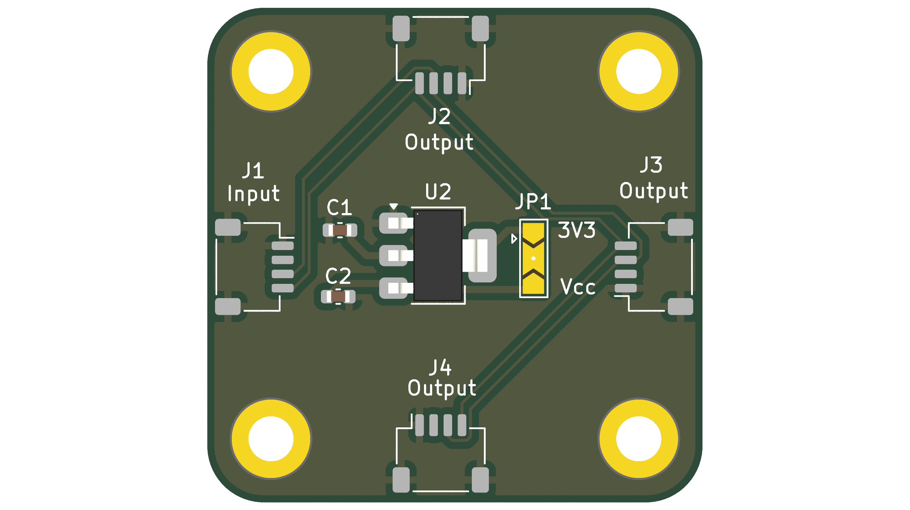
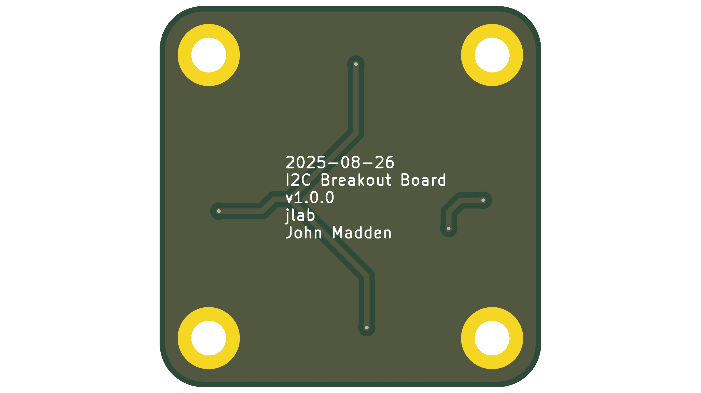

# I2C Breakout Board

The breakout board is intended to add additional headers for external I2C devices. The header labeled input expects 5V input from the I2C header and steps the voltage down to `3V3` for compatibility with Adafruit devices. If this is not desired, the power jumper can be changed.

  <figure>
    
    <figcaption>Top View</figcaption>
  </figure>
  <figure>
    
    <figcaption>Bottom View</figcaption>
  </figure>

