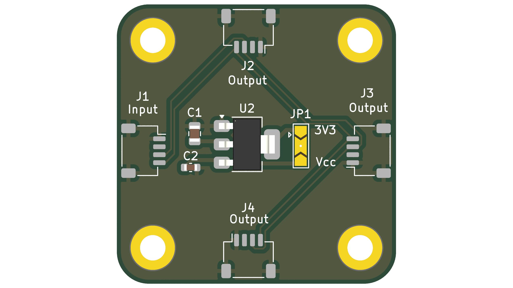

# SDI12 Breakout Board

This board add additional SDI-12 headers for connecting sensors. It also adds 3.5mm audio jacks that are commonly seen on SDI-12 sensors from METER.

| Top View | Bottom View |
| --- | --- |
|  |  |
