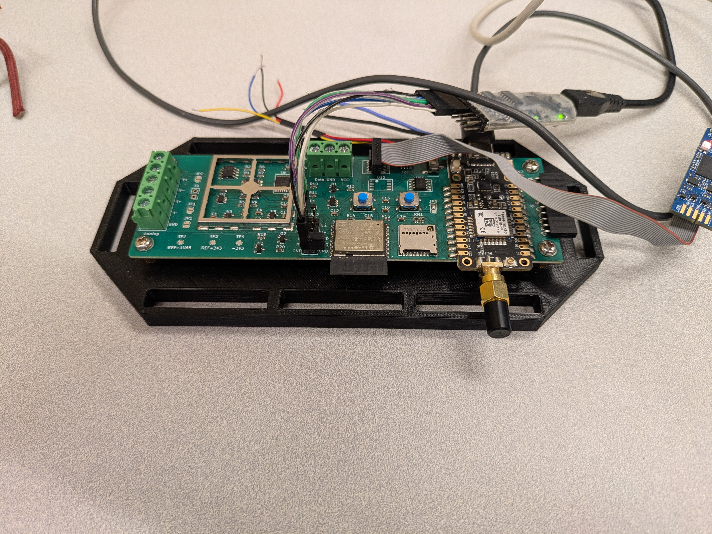
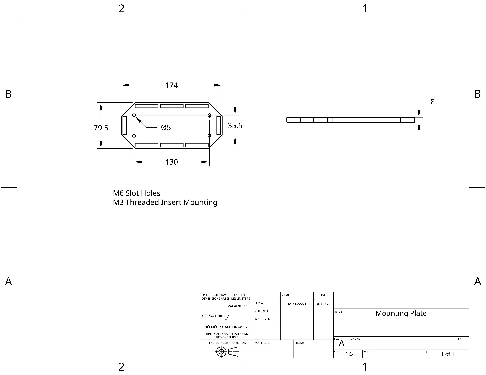

# Mounting Plate for ENTS-nodes

3D-printed mounting plate for ENTS-nodes. Useful for airgapping metal pins from conductive surfaces and mounting the nodes securely.

## Materials

| Item                   | Link    |
|------------------------|---------|
| M3 x 6mm x 5mm Inserts | [Amazon](https://www.amazon.com/dp/B0CTCSJ8YT?ref=fed_asin_title&th=1) |
| M3 Standoffs           | [Amazon](https://www.amazon.com/dp/B07KWVD986?ref=fed_asin_title) |
| M3 x 6mm Screws        | [Amazon](https://a.co/d/5NEkSzM) |

## Photo

## Drawing

