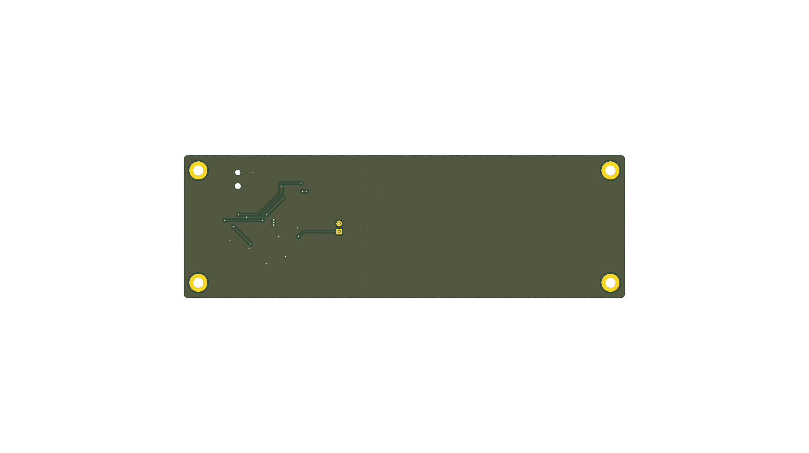

# Battery Board

The battery board adds two 18650 Li-ion battery and integrates a solar MPPT chip for charging. It uses a 5-pin JST connector to the ENTS board.

**Pin Configuration**

| # | Pin   | Description         |
|---| -------|---------------------|
| 1 | GND   | Ground              |
| 2 | VBAT  | Battery voltage     |
| 3 | 3.3V  | Regulated 3.3V      |
| 4 | !PG   | Power Good          |
| 5 | !CHG  | Charging status     |

| Top View |
| --- |
|  |

| Bottom View |
| --- |
|  |
